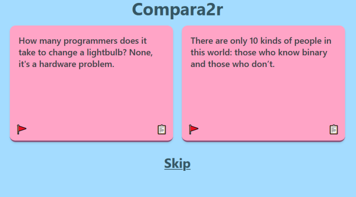

# Compara2r
Find out the best thing among a dataset through 1-vs-1 comparisons.

Made with [Node.js](https://nodejs.org/en/), [Express](https://expressjs.com/), [Tailwind CSS](https://tailwindcss.com/) and [PostgreSQL](https://www.postgresql.org/).

Try it out at [https://compara2r.herokuapp.com/](https://compara2r.herokuapp.com/).
Last time I checked, I was trying to figure out the best programming joke.



Any user can access a Compara2r site and vote on their favorite among the two options presented to them.
Users can vote as many times as they want and can also flag or copy any choices.

As the admin, you can export the results of a Compara2r setup and find out once and for all the best item in your dataset. You can also blacklist certain IPs (by manually editing the database lol).

## Setup and Run

You'll need [Node.js](https://nodejs.org/en/)

```
# Clone the repository with git (or do it your own way)
git clone https://github.com/NitroGuy10/Compara2r

# Install the requirements (once inside the cloned directory)
npm install
```

Then, create a file in the directory of the repo called `.env`

Inside the file, add the following:

```conf
DATABASE_URL="<the url of your postgres database>"
ADMIN_PASSWORD="<any password you want admins to use to access results data>"
```

Then add your [dataset](#creating-a-dataset) to a **new folder** inside the repo directory called `dataset/`

Now you can start the server!

```
npm run start
```

## Creating a Dataset

A dataset for use with Compara2r is a JSON file consisting of an list of objects.
The file must be called `dataset.json` and placed in the directory `dataset/` (which is not included in the repo).

Each object in the list should have a `"__compara2r_item"` attribute which contains the string to be shown to users as part of a comparison.

The reason the dataset is done this way is because you may have data you want associated with a given dataset item, but do not want shown to users. This "associated data" will appear in the results that can be downloaded by admins.

Example:

```json
[
    {"__compara2r_item": "Why are pythons blind? Because they can't 'C' !", "author": "Mr. Bingus"},
    {"__compara2r_item": "What's the best part about TCP jokes?\nI get to keep telling them until you get them!", "author": "Ms. Floppa"}
]
```
